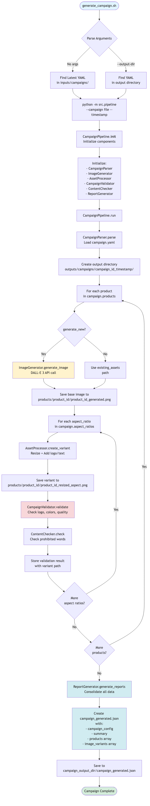

# Campaign Automation Pipeline

AI-powered campaign asset generation for social ad campaigns using DALL-E 3, computer vision, and brand compliance validation.

**Built for Fanatics Data Engineering Take-Home Exercise**

## Refine Campaign UI

The refine campaign interface provides a visual way to review, manage, and commit campaign outputs:

<div style="display: flex; flex-wrap: wrap; gap: 10px; margin: 20px 0;">
  
  
  
  
</div>

---

## Quick Setup

### 1. Clone and Run Setup
```bash
# Create workspace directory
mkdir -p ~/workspace-campaign-automation && cd ~/workspace-campaign-automation

# Clone the repository
git clone https://github.com/sbecker11/campaign-automation.git

# Navigate into the project
cd campaign-automation

# Run one-command setup (creates venv, installs dependencies, sets up pre-commit hook)
./setup.sh
```

**Note:** The project root is `~/workspace-campaign-automation/campaign-automation`

The setup script automatically:
- ✅ Creates virtual environment
- ✅ Installs all Python dependencies
- ✅ Installs package in editable mode
- ✅ Installs pre-commit hook (prevents committing output files)

### 2. Configure API Key
```bash
# Copy .env file from your workspace (if you have one)
# Or create a new one:
echo 'OPENAI_API_KEY=sk-your-key-here' > .env

# Or if you have an existing .env file:
cp ~/workspace-campaign-automation/campaign-automation/.env .  # Adjust path as needed
```

### 3. Verify Setup
```bash
# Check project structure
tree inputs/ -L 2

# List available campaigns
ls inputs/campaigns/

# View example campaign
cat inputs/campaigns/example_campaign.yaml
```

---

## Run Tests
```bash
# Run all tests
pytest tests/ -v

# Run with coverage
pytest --cov=src --cov-report=html tests/

# View coverage report
open htmlcov/index.html

# Run specific test file
pytest tests/test_campaign_parser.py -v

# Run with detailed output
pytest tests/ -v --tb=short
```

---

## Running a Campaign

### Quick Start
```bash
# Run the default campaign (example_campaign.yaml)
./run_campaign.sh

# Run a specific campaign
./run_campaign.sh inputs/campaigns/my_campaign.yaml
```

### Review Inputs
```bash
# View example campaign configuration
cat inputs/campaigns/example_campaign.yaml

# Check logo
open assets/generated_logo.png

# View project structure
tree inputs/ -L 2
```

**Example campaign highlights:**
- 2 products: Sunscreen + Beach Towel
- AI generates product images from descriptions
- 3 formats: 1:1, 9:16, 16:9
- Brand colors: #FF6B35, #004E89, #FFFFFF
- Message: "Your summer adventure starts here"

**Expected runtime:** ~50 seconds (2 products × ~20 sec DALL-E generation each)

**Expected cost:** ~$0.08 (2 products × $0.04/image)

### Review and Refine Outputs
```bash
# Open the refine UI for the latest campaign
./refine_campaign.sh

# Or open a specific campaign
./refine_campaign.sh summer_2024_20251116_104032

# View output structure manually
tree outputs/campaigns/summer_2024_20251116_104032 -L 3

# View consolidated campaign data
cat outputs/campaigns/summer_2024_20251116_104032/campaign_generated.json | python -m json.tool

# Count generated files
find outputs/campaigns/summer_2024_20251116_104032 -name "*.png" | wc -l
# Expected: 6 images (2 products × 3 formats)
```

**The `refine_campaign.sh` script opens a web-based UI where you can:**

- **HIDE OR SHOW IMAGES** - Mark images as hidden or visible
- **ADD COMMENTS** - Add notes to individual images (max 512 characters)
- **SAVE THE CAMPAIGN** - Use the "💾 Save Campaign" button to persist visibility and comments to `campaign_generated.json`
- **COMMIT CAMPAIGN CHANGES TO GITHUB** - Use the "📦 Commit Campaign" button to commit outputs to the separate outputs repository
- **EXIT THE REFINE UI** - Use the "🚪 Exit" button to close the server and browser window

The UI also provides:
- 📸 Visual grid view of all campaign images with thumbnails
- 🔍 Filtering by product, variant (aspect ratio), and status (visible/hidden)
- 📊 Live counts showing hidden/visible totals
- ✅ Validation indicators showing logo, color, and quality compliance status per image

**What to look for in outputs:**
- ✅ AI-generated product photos (sunscreen bottle, beach towel)
- ✅ Brand logo in top-right corner (with smart background)
- ✅ Text overlay: "Your summer adventure starts here"
- ✅ Three aspect ratios per product
- ✅ Brand colors present in images

### Campaign Generation Flow

The following diagram illustrates the complete campaign generation pipeline:



This flow shows how a campaign YAML file is processed through image generation, asset processing, validation, and reporting to produce the final campaign outputs.

---

## Refine Campaign Outputs

### Using the Refine UI
```bash
# Open refine UI for the latest campaign
./refine_campaign.sh

# Open refine UI for a specific campaign
./refine_campaign.sh summer_2024_20251116_104032
```

The `refine_campaign.sh` script launches a web-based interface for reviewing and managing campaign outputs. 

**Workflow:**

1. **HIDE OR SHOW IMAGES** - Click "🙈 Hide" to mark images as hidden (red border, grayscale effect) or "👁 Show" to mark hidden images as visible again

2. **ADD COMMENTS** - Add notes to any image (stored in `campaign_generated.json`, max 512 characters per image)

3. **SAVE THE CAMPAIGN** - Use the "💾 Save Campaign" button to persist all visibility and comment changes to `campaign_generated.json`

4. **COMMIT CAMPAIGN CHANGES TO GITHUB** - Use the "📦 Commit Campaign" button to commit outputs to the separate outputs repository on a campaign-specific branch

5. **EXIT THE REFINE UI** - Use the "🚪 Exit" button to close the server and browser window

**Additional Features:**
- 📸 Visual grid layout showing all generated images with thumbnails
- 🔍 Filtering by product, variant/aspect ratio (1:1, 9:16, 16:9, etc.), and status (visible, hidden, or any)
- 📊 Real-time hidden/visible counts that update as you work
- ✅ Compliance indicators showing logo, color, and quality validation status per image

### Quick Commands
```bash
# List all generated images
find outputs/campaigns -name "*.png" -type f

# Count total images
find outputs/campaigns -name "*.png" | wc -l

# View by format
find outputs/campaigns -path "*/1x1/*.png"
find outputs/campaigns -path "*/9x16/*.png"
find outputs/campaigns -path "*/16x9/*.png"

# View all reports
find outputs/campaigns -name "*.json"

# Check file sizes
du -sh outputs/campaigns/*/
```

---

## Output Files and Repository Structure

**Important:** Campaign output files (YAML, JSON, PNG) are stored in a **separate repository** (`campaign-automation-outputs`) to keep the main code repository lightweight.

### Preventing Accidental Commits

The repository includes a **pre-commit hook** that prevents committing any files in the `outputs/` directory to the main code branch. This ensures:

- ✅ Code changes stay in the main repository
- ✅ Output files are committed to the separate outputs repository
- ✅ No accidental commits of large binary/image files

**If you try to commit files in `outputs/`, the commit will be blocked with an error message.**

### Committing Outputs

To commit campaign outputs, use one of these methods:

1. **Via the Refine UI**: Use the "📦 Commit Campaign" button in the refine interface
2. **Directly in outputs repo**: Navigate to the `campaign-automation-outputs` repository and commit there

The pre-commit hook will guide you if you accidentally try to commit outputs to the main repo.

---

## Project Structure
```
campaign-automation/
├── inputs/
│   └── campaigns/                      # Campaign YAML files
│       └── example_campaign.yaml       # Example campaign configuration
├── outputs/                            # Symlink to campaign-automation-outputs repository
│   └── campaigns/                      # Generated campaign outputs (separate repo)
│       └── summer_2024/
│           ├── products/               # Product images by aspect ratio
│           │   ├── sunscreen_spf50/
│           │   │   ├── 1x1/
│           │   │   ├── 9x16/
│           │   │   └── 16x9/
│           │   └── beach_towel/
│           └── reports/                # Generation and compliance reports
├── assets/
│   └── generated_logo.png              # Logo (auto-generated if missing)
├── src/                                # Source code
│   ├── pipeline.py                     # Main orchestrator
│   ├── campaign_parser.py              # YAML parsing
│   ├── image_generator.py              # DALL-E 3 integration
│   ├── asset_processor.py              # Image processing
│   ├── campaign_validator.py           # Campaign compliance validation
│   ├── content_checker.py              # Content compliance
│   ├── report_generator.py             # JSON reports
│   └── utils.py                        # Utilities
├── tests/                              # Unit tests
├── temp/                               # Temporary files
├── run_campaign.sh                     # Main runner script
├── refine_campaign.sh                  # Campaign refinement UI launcher
├── requirements.txt                    # Python dependencies
├── setup.py                            # Package setup
├── .env                                # Environment variables (create this)
└── README.md                           # This file
```

---

## Features

### 🎨 GenAI Image Generation
- DALL-E 3 integration with brand-aware prompts
- Automatic product photography from text descriptions
- Cost: ~$0.04 per product image

### 📐 Multi-Format Support
- **1:1** - Instagram feed, Facebook posts
- **9:16** - Instagram/TikTok Stories, Reels
- **16:9** - YouTube, Facebook video, Display ads

### 💬 Smart Text Overlays
- Automatic text wrapping for long messages
- Contrast detection for readability
- Semi-transparent backgrounds when needed

### 🎯 Adaptive Logo Placement
- Always top-right corner
- Smart background detection
- Adds white/black background when colors clash
- Uses computer vision for color similarity

### ✅ Brand Validation
- Logo detection using template matching
- Color compliance checking
- Brand guidelines enforcement
- Computer vision-based (no ML training required)

### 🔍 Content Safety
- Prohibited words checking
- Configurable word blacklist
- Campaign message validation

### 📊 Detailed Reporting
- Generation report (products, variants, status)
- Compliance report (validation results)
- JSON format for easy integration

### 🎯 Campaign Management
- Simple YAML-based configuration
- Centralized asset management
- Easy to add new campaigns

---

## Campaign Configuration Format

### Basic Structure
```yaml
campaign_id: "unique_campaign_id"
campaign_name: "Display Name"

products:
  - product_id: "product_id"
    name: "Product Display Name"
    description: "Product description"
    # Choose one:
    generate_new: true                    # AI-generate image (default)
    # OR
    generate_new: false
    existing_assets: "path/to/assets/"    # Use existing photo

target_market: "US"
target_audience: "demographic_description"
campaign_message: "Text overlay message"

brand_guidelines:
  brand_colors:
    - "#HEX_COLOR_1"
    - "#HEX_COLOR_2"
  logo_required: false                    # Logo is optional

aspect_ratios:
  - "1:1"
  - "9:16"
  - "16:9"

content_safety:
  prohibited_words:
    - "guaranteed"
    - "miracle"
  require_disclaimer: false
```

### Product Configuration Options

**Option 1: Generate with AI (default)**
```yaml
products:
  - product_id: "new_product"
    name: "Product Name"
    description: "Detailed description for AI generation"
    generate_new: true
```

**Option 2: Use existing photo**
```yaml
products:
  - product_id: "existing_product"
    name: "Product Name"
    description: "Product description"
    generate_new: false
    existing_assets: "path/to/image/directory/"
```

**Option 3: Mix both approaches**
```yaml
products:
  - product_id: "new_product"
    generate_new: true
  
  - product_id: "existing_product"
    generate_new: false
    existing_assets: "assets/existing/"
```

---

## Creating a New Campaign
```bash
# 1. Create campaign YAML file
cat > inputs/campaigns/my_campaign.yaml << 'YAML'
campaign_id: "my_campaign_2024"
campaign_name: "My Campaign"

products:
  - product_id: "product_1"
    name: "Product Name"
    description: "Product description"
    generate_new: true

target_market: "US"
target_audience: "target_demographic"
campaign_message: "Your message here"

brand_guidelines:
  brand_colors:
    - "#FF6B35"
  logo_required: false

aspect_ratios:
  - "1:1"
  - "9:16"
  - "16:9"

content_safety:
  prohibited_words: []
  require_disclaimer: false
YAML

# 2. (Optional) Add custom logo
cp your_logo.png assets/generated_logo.png
# Or specify a custom path in the campaign YAML: logo_path: "path/to/your/logo.png"

# 3. Run campaign
./run_campaign.sh inputs/campaigns/my_campaign.yaml

# 4. View outputs
./refine_campaign.sh my_campaign_2024_20251116_104032
```

---

## Technical Stack

- **Python 3.9+**
- **OpenAI DALL-E 3** - AI image generation
- **Pillow (PIL)** - Image processing & manipulation
- **OpenCV** - Computer vision (logo detection, color analysis)
- **PyYAML** - Configuration parsing
- **pytest** - Testing framework
- **argparse** - Command-line interface

---

## Cost & Performance

### Example Campaign (AI-Generated)
- **Time:** ~50 seconds
- **Cost:** ~$0.08 (2 products × $0.04)
- **Output:** 6 images (2 products × 3 formats)

### Using Existing Assets
- **Time:** ~5 seconds
- **Cost:** $0.00
- **Output:** 3 images (1 product × 3 formats)

### Comparison
- **Speed:** 10x faster with existing assets
- **Cost:** $0 vs $0.08 per campaign
- **Quality:** Professional results either way

---

## Design Decisions

1. **Simple campaign structure** - Easy to organize and scale
2. **Computer vision validation** - No ML training required, deterministic results
3. **Smart logo backgrounds** - Automatic contrast detection via color similarity
4. **Multi-line text wrapping** - Handles long messages across all formats
5. **Cached validation** - Logo validated once per pipeline run for efficiency
6. **Modular architecture** - Each component independently testable
7. **Convention over configuration** - Logo path auto-resolved from assets folder
8. **Flexible asset sources** - Support for both AI-generated and existing images

---

## Troubleshooting

### "Logo file not found"
```bash
# Check if logo exists
ls -lh assets/generated_logo.png

# Pipeline will auto-create default logo if missing
./run_campaign.sh
```

### "OPENAI_API_KEY not set"
```bash
# Create or edit .env file
echo 'OPENAI_API_KEY=sk-your-key-here' > .env

# Or copy from existing location
cp ~/workspace-campaign-automation/campaign-automation/.env .

# Verify it's set
source .env
echo $OPENAI_API_KEY
```

### "Module not found"
```bash
# Make sure venv is activated
source venv/bin/activate

# Reinstall package in editable mode
pip install -e .

# Or reinstall dependencies
pip install -r requirements.txt
```

### "Asset path not found"
```bash
# Check asset exists
ls -lh path/to/your/assets/

# Make sure the path in your campaign YAML is correct
cat inputs/campaigns/your_campaign.yaml
```

### Campaign fails with no images
```bash
# Check generation report for errors
cat outputs/campaigns/campaign_id/reports/generation_report.json | python -m json.tool

# Verify .env file has valid API key
grep OPENAI_API_KEY .env
```

---

## Quick Reference Commands
```bash
# List all campaigns
ls inputs/campaigns/

# Run default campaign
./run_campaign.sh

# Run specific campaign
./run_campaign.sh inputs/campaigns/my_campaign.yaml

# View campaign outputs
./refine_campaign.sh

# View specific campaign
./refine_campaign.sh campaign_id_timestamp

# Count generated images
find outputs/campaigns -name "*.png" | wc -l

# Open campaign outputs
open outputs/campaigns/summer_2024/

# Run tests
pytest tests/ -v

# Run tests with coverage
pytest tests/ -v --cov=src --cov-report=html

# Clean outputs (start fresh)
rm -rf outputs/campaigns/*
```

---

## Demo Video Script

For a 2-3 minute demo video, follow this flow:

### Part 1: Setup (45 seconds)
- Clone repository
- Create virtual environment
- Install dependencies
- Configure API key

### Part 2: Project Structure (30 seconds)
```bash
tree inputs/ -L 2
cat inputs/campaigns/example_campaign.yaml
```

### Part 3: Run Campaign (60 seconds)
```bash
./run_campaign.sh
```
**While running:**
- "Step 1: Parsing campaign yaml file..."
- "Step 2: Generating images with DALL-E..."
- "Creating variants for 1:1 Instagram, 9:16 Stories..."
- "Step 3: Validating brand compliance - checking colors, prohibited words..."
- "Generating compliance reports..."

### Part 4: Results (30 seconds)
```bash
./refine_campaign.sh
# Refine UI opens in browser - show filtering, hiding images, adding comments
cat outputs/campaigns/summer_2024_20251116_104032/campaign_generated.json | head -20
```

### Part 5: Testing & Quality (25 seconds)
```bash
pytest tests/ -v --cov=src --cov-report=html
open htmlcov/index.html
```

### Part 6: Wrap Up (15 seconds)
- Highlight key features
- Summary of capabilities

See `DEMO_SCRIPT_COMPLETE.md` for the full detailed demo script.

---

**Built by Shawn Becker for Fanatics Data Engineering Take-Home Exercise**

**Repository:** https://github.com/sbecker11/campaign-automation  
**GitHub:** https://github.com/sbecker11  
**LinkedIn:** https://linkedin.com/in/shawnbecker

## Testing

### Run All Tests with Coverage
```bash
# Activate virtual environment
source venv/bin/activate

# Run tests with coverage report
pytest tests/ -v --cov=src --cov-report=term-missing --cov-report=html

# View HTML coverage report
open htmlcov/index.html
```

### Test Suite Overview

- **Total Tests**: 78 passing, 2 skipped
- **Code Coverage**: 75%
- **Execution Time**: ~2.5 seconds

### Run Specific Test Files
```bash
# Test a specific module
pytest tests/test_brief_parser.py -v

# Test with verbose output
pytest tests/ -v

# Run tests without coverage (faster)
pytest tests/
```

### Coverage Targets

- `content_checker.py`: 88%
- `image_generator.py`: 88%
- `campaign_parser.py`: 83%
- `report_generator.py`: 82%
- `utils.py`: 100%
- `pipeline.py`: 64%
- `asset_processor.py`: 62%

# Campaign Automation

## Quick Start

1) Generate latest (uses most recent YAML, timestamped):
```
./generate_campaign.sh
```

2) Generate for a specific existing output directory (reads YAML inside, writes status.json there):
```
./generate_campaign.sh --output-dir outputs/campaigns/<campaign_id_or_run>
```

- Refine latest campaign:
```
./refine_campaign.sh
```
- Refine with filters (campaign/product/aspect/status):
```
./refine_campaigns.sh
```

## Scripts
- `generate_campaign.sh`                    # Main generator (two modes: default, --output-dir)
- `refine_campaign.sh`                      # Open latest campaign for review
- `refine_campaigns.sh`                     # Interactive refine tool with filters

## Notes
- `--timestamp current` appends `YYYYMMDD_HHMMSS` to the output campaign directory name to avoid overwrites.

