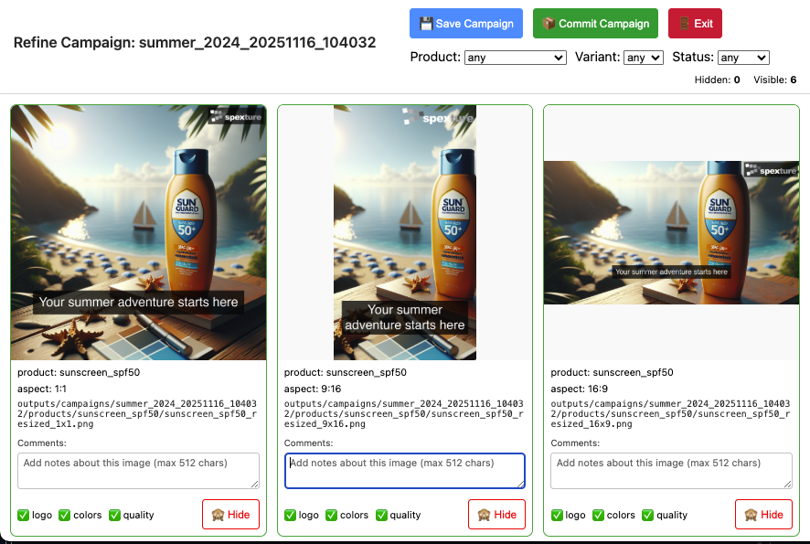
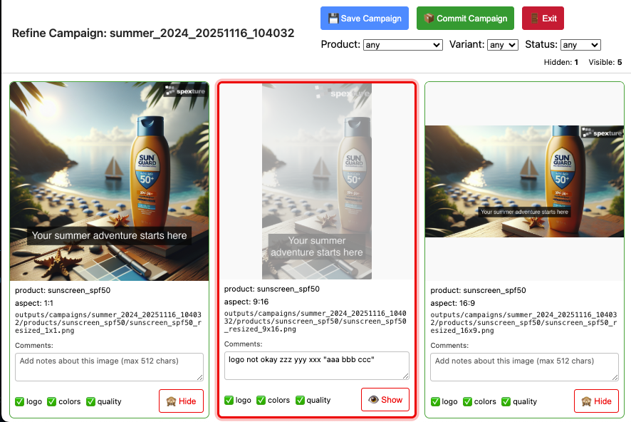
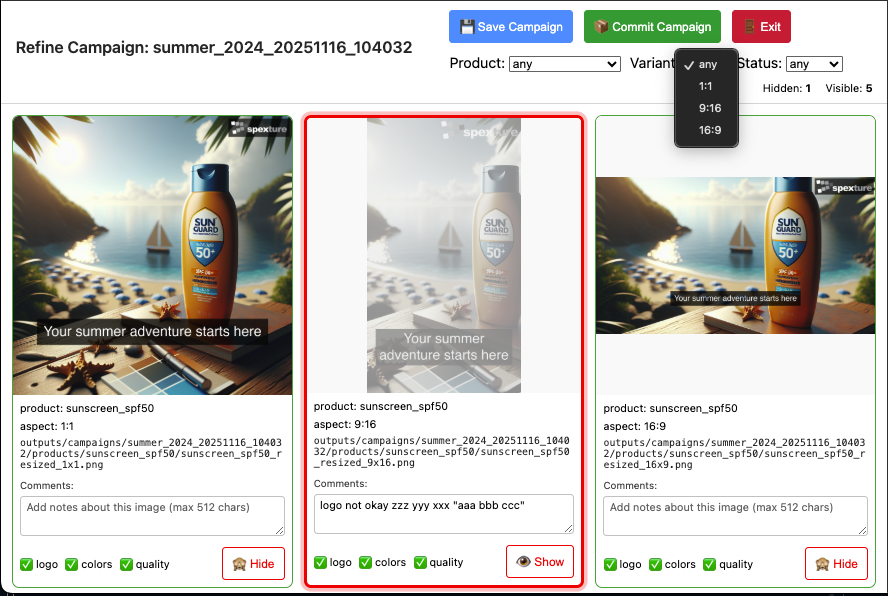
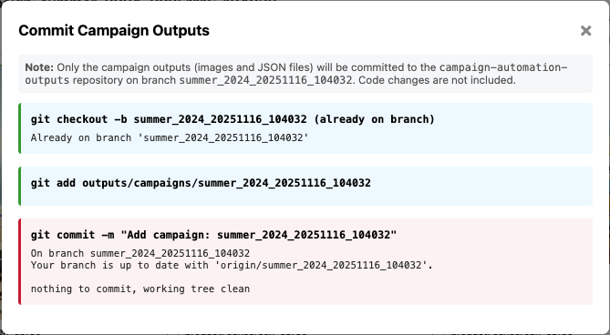

# Campaign Automation Pipeline

AI-powered campaign asset generation for social ad campaigns using DALL-E 3, computer vision, and brand compliance validation.

**Built for Fanatics Data Engineering Take-Home Exercise**

## Refine Campaign UI

The refine campaign interface provides a visual way to review, manage, and commit generated campaign instances:

<div style="display: flex; flex-wrap: wrap; gap: 10px; margin: 20px 0;">
  
  
  
  
</div>

---

## Demo Video

Watch a complete walkthrough of the Campaign Automation Pipeline in action:

**[📹 View Demo Video](https://www.dropbox.com/scl/fi/vtswpa6v5tuvahtna3ar8/DEMO_MOVIE_compressed.mov?rlkey=8csw89ojiyvopt73ehkjx5rfz&st=bc3v919q&dl=0)**

*(Note: The compressed video file is ~96MB. Click the link above to view or download it from DropBox.)*

The demo video demonstrates:
- Setting up the project and configuring your API key
- Reviewing campaign configuration files
- Generating campaign instances with AI-powered image creation
- Using the refine UI to review and manage campaign assets
- Running tests and viewing coverage reports

---

## Getting Started

### Prerequisites

Before you begin, you'll need:

1. **A terminal window** - This is where you'll type commands
   - **macOS**: Press `Cmd+Space`, type "Terminal", press Enter
   - **Windows**: 
     - **Option 1 (Recommended)**: After installing Git, open "Git Bash" from the Start menu
       - Click the Windows Start button
       - Type "Git Bash" and click on it
       - This is the best option for running bash scripts
     - **Option 2**: Press `Win+R`, type `cmd`, press Enter (basic Windows terminal)

2. **Git** - For downloading the project
   - If not installed, visit: https://git-scm.com/downloads
   - **Windows users**: Git for Windows includes "Git Bash" automatically
   - The setup script will check and guide you if Git is missing

3. **Python 3** - Required to run the project
   - If not installed, visit: https://www.python.org/downloads/
   - **Windows users**: Make sure to check "Add Python to PATH" during installation
   - The setup script will check and guide you if Python 3 is missing

### Quick Setup

Once you have the prerequisites, follow these steps:

1. **Open a terminal window** (see above)

2. **Create a directory for your projects** - Copy and paste this command, then press Enter:
   ```bash
   mkdir -p ~/my-github-projects
   ```

3. **Go into that directory** - Copy and paste this command, then press Enter:
   ```bash
   cd ~/my-github-projects
   ```

4. **Download the project** - Copy and paste this command, then press Enter:
   ```bash
   git clone https://github.com/sbecker11/campaign-automation.git
   ```

5. **Go into the project folder** - Copy and paste this command, then press Enter:
   ```bash
   cd campaign-automation
   ```

6. **Run the setup script** - Copy and paste this command, then press Enter:
   ```bash
   ./setup.sh
   ```

The setup script will:
- ✅ Check that Git and Python 3 are installed
- ✅ Create a virtual environment
- ✅ Install all Python dependencies
- ✅ Install the package in editable mode
- ✅ Guide you through configuring your OpenAI API key

**Note:** The project root is `~/my-github-projects/campaign-automation`

---

# View project structure
```
campaign-automation/
├── inputs/
│   └── campaigns/                      # Campaign configuration files (YAML)
│       └── example_campaign.yaml       # Example campaign configuration
├── outputs/                            # Symlink (shortcut) to external repo
│   └── campaigns/                      # Generated campaign instances (stored in 
|       |                               # separate campaign-automation-outputs repo)
│       └── summer_2024/
│           ├── campaign_instance.json
│           └── products/               # Product images by aspect ratio
│               ├── sunscreen_spf50/
│               │   ├── 1x1/
│               │   ├── 9x16/
│               │   └── 16x9/
│               └── beach_towel/
│                   ├── 1x1/
│                   ├── 9x16/
│                   └── 16x9/
├── assets/
│   └── spexture.com-logo.png           # Logo file (optional, PNG format)
├── src/                                # Source code
│   ├── pipeline.py                     # Main orchestrator
│   ├── campaign_parser.py              # YAML parsing
│   ├── image_generator.py              # DALL-E 3 integration
│   ├── asset_processor.py              # Image processing
│   ├── campaign_validator.py           # Campaign compliance validation
│   ├── content_checker.py              # Content compliance
│   ├── instance_generator.py           # Campaign instance JSON generation
│   └── utils.py                        # Utilities
├── tests/                              # Unit tests
├── scripts/
│   ├── run_tests_w_coverage.sh         # Runs all unit tests 
│   ├── generate_campaign.sh            # Main campaign instance generator script
│   └── refine_campaign.sh              # Campaign instance refinement UI launcher
├── requirements.txt                    # Python dependencies
├── setup.py                            # Package setup
├── .env                                # Environment variables (create this)
└── README.md                           # This file
```


---

## Run Tests
```bash
# Make sure you're in the project directory
cd ~/my-github-projects/campaign-automation

# Activate virtual environment (if not already active)
source venv/bin/activate

# Run all tests with coverage
./scripts/run_tests_w_coverage.sh

# View coverage report in browser
# Option 1 (macOS): Opens directly
open htmlcov/index.html

# Option 2 (All platforms): Get file:// URL and open in browser
# For macOS/Linux/Git Bash (Windows):
COV_URL="file://$(pwd)/htmlcov/index.html"
echo $COV_URL
# Copy the output and paste it into your browser's address bar

# For Windows cmd.exe (if not using Git Bash):
# set COV_URL=file:///%CD:\=/%/htmlcov/index.html
# echo %COV_URL%

# Run specific test file
pytest tests/test_campaign_parser.py -v

# Run with detailed output
pytest tests/ -v --tb=short

# Run tests without coverage (faster)
pytest tests/
```

### Test Suite Overview

- **Total Tests**: 78 passing, 2 skipped
- **Code Coverage**: 75%
- **Execution Time**: ~2.5 seconds

### Coverage Targets

- `content_checker.py`: 88%
- `image_generator.py`: 88%
- `campaign_parser.py`: 83%
- `instance_generator.py`: 82%
- `utils.py`: 100%
- `pipeline.py`: 64%
- `asset_processor.py`: 62%

---

## Generating a Campaign

### Step 1: Review the Campaign Configurations

```bash
ls -R inputs/
```

**Important:** Review the campaign configuration file before generating campaign instances.

```bash
# View the example campaign configuration
cat inputs/campaigns/example_campaign.yaml

----
**What to review in the campaign configuration file:**

1. **Campaign Information:**
   - `campaign_id`: Unique identifier for this campaign. Used to create the campaign instance directory path: `outputs/campaigns/{campaign_id}_{timestamp}/` (e.g., `outputs/campaigns/summer_2024_20241116_143022/`). Each generation creates a new timestamped campaign instance, allowing you to generate multiple instances from the same campaign configuration.
   - `campaign_name`: Display name for the campaign
   - `target_market` and `target_audience`: Used for targeting
   - `campaign_tagline`: Campaign tagline that will appear on images

2. **Products:**
   - `product_id`: Unique identifier for each product
   - `name`: Product name
   - `description`: Product description
   - `generate_new`: Whether to generate new images with AI or use existing assets
   - `existing_assets`: Path to directory containing image files (if using existing assets)
   - For detailed product image configuration options, see [Product Image Configuration](docs/product_image_configuration.md)

3. **Brand Guidelines:**
   - `brand_colors`: Colors used as guidelines for AI image generation and validated in generated images
   - `logo_path`: Path to your logo file (optional - see [Logo Requirements](docs/logo_requirements.md)) 

4. **Aspect Ratios:**
   - Formats to generate: `1:1` (Instagram), `9:16` (Stories), `16:9` (Landscape)
   - Each product will generate images in all specified formats

5. **Content Safety:**
   - `prohibited_words`: Words that will be flagged if found in generated content

**Example campaign configuration details:**
- 2 products: Sunscreen + Beach Towel
- Both set to `generate_new: true` (AI will create images)
- 3 formats: 1:1, 9:16, 16:9
- Brand colors: #FF6B35, #004E89, #FFFFFF
- Tagline: "Your summer adventure starts here".

**Expected runtime:** ~50 seconds (2 products × ~20 sec DALL-E generation each)

**Expected cost:** ~$0.08 (2 products × $0.04/image)

### Step 2: Generate the Campaign

After reviewing the configuration, generate the campaign:

```bash
# Generate the default campaign (uses the most recently modified YAML file in inputs/campaigns/)
./scripts/generate_campaign.sh

# Or generate a specific campaign file
./scripts/generate_campaign.sh inputs/campaigns/example_campaign.yaml
```

This will create a new campaign instance in `outputs/campaigns/` with a timestamp. The campaign instance directory structure will be:
- `outputs/campaigns/{campaign_id}_{timestamp}/` - Main campaign directory
  - `products/` - Product images organized by product_id and aspect ratio
  - `campaign_instance.json` - Consolidated campaign instance data

Each generation creates a new timestamped campaign instance directory (format: `YYYYMMDD_HHMMSS`), so you can generate multiple instances from the same campaign configuration without overwriting previous results.

### Step 3: Review and Refine Campaign Instances
```bash
# Open the refine UI for the latest campaign
./scripts/refine_campaign.sh

# Or open a specific campaign
./scripts/refine_campaign.sh summer_2024_20251116_104032

# View output structure manually
ls -R outputs/campaigns/summer_2024_20251116_104032

# View consolidated campaign data
cat outputs/campaigns/summer_2024_20251116_104032/campaign_instance.json | python -m json.tool

# Count generated files
find outputs/campaigns/summer_2024_20251116_104032 -name "*.png" | wc -l
# Expected: 6 images (2 products × 3 formats)
```

**The `./scripts/refine_campaign.sh` script opens a web-based UI where you can:**

- **HIDE OR SHOW IMAGES** - Mark images as hidden or visible
- **ADD COMMENTS** - Add notes to individual images (max 512 characters)
- **SAVE THE CAMPAIGN** - Use the "💾 Save Campaign" button to persist visibility and comments to `campaign_instance.json`
- **COMMIT CAMPAIGN CHANGES TO GITHUB** - Use the "📦 Commit Campaign" button to commit campaign instances to the separate outputs repository
- **EXIT THE REFINE UI** - Use the "🚪 Exit" button to close the server and browser window

The UI also provides:
- 📸 Visual grid view of all campaign images with thumbnails
- 🔍 Filtering by product, variant (aspect ratio), and status (visible/hidden)
- 📊 Live counts showing hidden/visible totals
- ✅ Validation indicators showing logo, color, and quality compliance status per image

**What to look for in campaign instances:**
- ✅ AI-generated product photos (sunscreen bottle, beach towel)
- ✅ Brand logo in top-right corner (with smart background)
- ✅ Text overlay tagline: "Your summer adventure starts here"
- ✅ Three aspect ratios per product
- ✅ Brand colors present in images

### Campaign Generation Flow

The following diagram illustrates the complete campaign generation pipeline:


This flow shows how a campaign configuration file is processed through image generation, asset processing, validation, and reporting to produce the final campaign instances.

---

## Refine Campaign Instances

### Using the Refine UI
```bash
# Open refine UI for the latest campaign
./scripts/refine_campaign.sh

# Open refine UI for a specific campaign
./scripts/refine_campaign.sh summer_2024_20251116_104032
```

The `./scripts/refine_campaign.sh` script launches a web-based interface for reviewing and managing campaign instances. 

**Workflow:**

1. **HIDE OR SHOW IMAGES** - Click "🙈 Hide" to mark images as hidden (red border, grayscale effect) or "👁 Show" to mark hidden images as visible again

2. **ADD COMMENTS** - Add notes to any image (stored in `campaign_instance.json`, max 512 characters per image)

3. **SAVE THE CAMPAIGN** - Use the "💾 Save Campaign" button to persist all visibility and comment changes to `campaign_instance.json`

4. **COMMIT CAMPAIGN CHANGES TO GITHUB** - Use the "📦 Commit Campaign" button to commit campaign instances to the separate outputs repository on a campaign-specific branch

5. **EXIT THE REFINE UI** - Use the "🚪 Exit" button to close the server and browser window

**Additional Features:**
- 📸 Visual grid layout showing all generated images with thumbnails
- 🔍 Filtering by product, variant/aspect ratio (1:1, 9:16, 16:9, etc.), and status (visible, hidden, or any)
- 📊 Real-time hidden/visible counts that update as you work
- ✅ Compliance indicators showing logo, color, and quality validation status per image

### Quick Commands
```bash
# List all generated images
find outputs/campaigns -name "*.png" -type f
# Windows alternative (Git Bash): Same command works
# Windows cmd.exe: dir /s /b outputs\campaigns\*.png

# Count total images
find outputs/campaigns -name "*.png" | wc -l
# Windows alternative (Git Bash): Same command works
# Windows cmd.exe: dir /s /b outputs\campaigns\*.png | find /c ".png"

# View by format
find outputs/campaigns -path "*/1x1/*.png"
find outputs/campaigns -path "*/9x16/*.png"
find outputs/campaigns -path "*/16x9/*.png"
# Windows alternative (Git Bash): Same commands work

# View all campaign instance JSON files
find outputs/campaigns -name "campaign_instance.json"
# Windows alternative (Git Bash): Same command works

# Check file sizes
du -sh outputs/campaigns/*/
# Windows alternative (Git Bash): Same command works
# Windows cmd.exe: for /d %d in (outputs\campaigns\*) do @dir /s "%d" | find "File(s)"
```

---

## Campaign Instances and Repository Structure

**Important:** Campaign instance files (YAML, JSON, PNG) are stored in a **separate repository** (`campaign-automation-outputs`) to keep the main code repository lightweight.

### Setting Up the Outputs Repository

The `outputs/` directory is a **symlink** (symbolic link - a shortcut that points to another location) to a separate Git repository. This allows:
- ✅ Keeping generated images out of the main code repository
- ✅ Version controlling campaign instances separately
- ✅ Maintaining a clean, fast main repository

**To set up the outputs repository:**
1. Clone the separate outputs repository (if it exists) or create a new one
2. Create a symlink: `ln -s /path/to/campaign-automation-outputs outputs`
3. The `outputs/` directory will now point to the separate repository

**Note:** If you're just getting started, you can use the `outputs/` directory normally - the symlink setup is optional for advanced workflows.

### Preventing Accidental Commits

The repository includes a **pre-commit hook** (an automated check that runs before Git commits) that prevents committing any files in the `outputs/` directory to the main code branch. This ensures:

- ✅ Code changes stay in the main repository
- ✅ Campaign instance files are committed to the separate outputs repository
- ✅ No accidental commits of large binary/image files

**If you try to commit files in `outputs/`, the commit will be blocked with an error message.**

### Committing Campaign Instances

To commit campaign instances, use one of these methods:

1. **Via the Refine UI**: Use the "📦 Commit Campaign" button in the refine interface
2. **Directly in outputs repo**: Navigate to the `campaign-automation-outputs` repository and commit there

The pre-commit hook will guide you if you accidentally try to commit campaign instances to the main repo.

---

---

## Features

### 🎨 GenAI Image Generation
- DALL-E 3 integration with brand-aware prompts
- Automatic product photography from text descriptions
- Cost: ~$0.04 per product image

### 📐 Multi-Format Support
- **1:1** - Instagram feed, Facebook posts
- **9:16** - Instagram/TikTok Stories, Reels
- **16:9** - YouTube, Facebook video, Display ads

### 💬 Smart Text Overlays
- Automatic text wrapping for long messages
- Contrast detection for readability
- Semi-transparent backgrounds when needed

### 🎯 Adaptive Logo Placement
- Always top-right corner
- Smart background detection
- Adds white/black background when colors clash
- Uses computer vision for color similarity

### ✅ Brand Validation
- Logo detection using template matching (computer vision technique that finds logos by comparing image patterns)
- Color compliance checking (verifies brand colors appear in generated images)
- Brand guidelines enforcement
- Computer vision-based (no ML training required - uses image analysis algorithms instead of machine learning)

### 🔍 Content Safety
- Prohibited words checking
- Configurable word blacklist
- Brand tagline validation

### 📊 Detailed Reporting
- Generation report (products, variants, status)
- Compliance report (validation results)
- JSON format for easy integration

### 🎯 Campaign Management
- Simple YAML-based configuration
- Centralized asset management
- Easy to add new campaigns

---

## Campaign Configuration Format

### Basic Structure
```yaml
campaign_id: "unique_campaign_id"
campaign_name: "Display Name"

products:
  - product_id: "product_id"
    name: "Product Display Name"
    description: "Product description"
    # Choose one:
    generate_new: true                    # AI-generate image (default)
    # OR
    generate_new: false
    existing_assets: "path/to/assets/"    # Use existing photo

target_market: "US"
target_audience: "demographic_description"
campaign_tagline: "Text overlay tagline"

brand_guidelines:
  brand_colors:
    - "#HEX_COLOR_1"
    - "#HEX_COLOR_2"

aspect_ratios:
  - "1:1"
  - "9:16"
  - "16:9"

content_safety:
  prohibited_words:
    - "guaranteed"
    - "miracle"
```

### Product Configuration Options

For detailed information about configuring product images (AI generation vs. existing assets), see [Product Image Configuration](docs/product_image_configuration.md).

---

## Creating a New Campaign
```bash
# 1. Create campaign YAML file
cat > inputs/campaigns/my_campaign.yaml << 'YAML'
campaign_id: "my_campaign_2024"
campaign_name: "My Campaign"

products:
  - product_id: "product_1"
    name: "Product Name"
    description: "Product description"
    generate_new: true

target_market: "US"
target_audience: "target_demographic"
campaign_tagline: "Your tagline here"

brand_guidelines:
  brand_colors:
    - "#FF6B35"

aspect_ratios:
  - "1:1"
  - "9:16"
  - "16:9"

content_safety:
  prohibited_words: []
YAML

# 2. (Optional) Add your logo file
# If you want to use a logo, add it and specify logo_path in your campaign YAML
# See docs/logo_requirements.md for format and dimension requirements
cp your_logo.png assets/spexture.com-logo.png
# Then specify the path in your campaign YAML: logo_path: "assets/spexture.com-logo.png"

# 3. Generate campaign instance
./scripts/generate_campaign.sh inputs/campaigns/my_campaign.yaml

# 4. View campaign instance
./scripts/refine_campaign.sh my_campaign_2024_20251116_104032
```

---

## Technical Stack

- **Python 3.9+**
- **OpenAI DALL-E 3** - AI image generation
- **Pillow (PIL)** - Image processing & manipulation
- **OpenCV** - Computer vision (logo detection, color analysis)
- **PyYAML** - Configuration parsing
- **pytest** - Testing framework
- **argparse** - Command-line interface

---

## Cost & Performance

### Example Campaign (AI-Generated)
- **Time:** ~50 seconds
- **Cost:** ~$0.08 (2 products × $0.04)
- **Output:** 6 images (2 products × 3 formats)

### Using Existing Assets
- **Time:** ~5 seconds
- **Cost:** $0.00
- **Output:** 3 images (1 product × 3 formats)

### Comparison
- **Speed:** 10x faster with existing assets
- **Cost:** $0 vs $0.08 per campaign
- **Quality:** Professional results either way

---

## Design Decisions

1. **Simple campaign structure** - Easy to organize and scale
2. **Computer vision validation** - No ML training required, deterministic results (uses image analysis algorithms instead of machine learning models)
3. **Smart logo backgrounds** - Automatic contrast detection via color similarity (compares logo colors with background to ensure readability)
4. **Multi-line text wrapping** - Handles long messages across all formats
5. **Cached validation** - Logo validated once per campaign generation for efficiency
6. **Modular architecture** - Each component independently testable
7. **Convention over configuration** - Logo path auto-resolved from assets folder (uses standard location instead of requiring explicit configuration)
8. **Flexible asset sources** - Support for both AI-generated and existing images

---

## For Developers

### Architecture Overview

The pipeline follows a modular architecture with clear separation of concerns:

1. **`campaign_parser.py`** - Parses YAML configuration files, validates structure, applies defaults
2. **`image_generator.py`** - Interfaces with OpenAI DALL-E 3 API for AI image generation
3. **`asset_processor.py`** - Handles image processing: resizing, text overlays, logo placement
4. **`campaign_validator.py`** - Validates brand compliance using computer vision (logo detection, color analysis)
5. **`content_checker.py`** - Validates content safety (prohibited words, message validation)
6. **`instance_generator.py`** - Generates campaign instance JSON files with campaign metadata and validation results
7. **`pipeline.py`** - Main orchestrator that coordinates all components
8. **`utils.py`** - Shared utility functions

### Extension Points

**Adding New Validation Rules:**
- Extend `campaign_validator.py` with new validation methods
- Add validation results to the instance structure in `instance_generator.py`

**Adding New Image Formats:**
- Modify `asset_processor.py` to handle new aspect ratios
- Update `campaign_parser.py` to accept new format strings

**Custom Image Processing:**
- Extend `asset_processor.py` with new processing functions
- Hook into the pipeline via `pipeline.py`

### Development Setup

```bash
# Clone repository
git clone https://github.com/sbecker11/campaign-automation.git
cd campaign-automation

# Create virtual environment
python3 -m venv venv
source venv/bin/activate  # On Windows: venv\Scripts\activate

# Install dependencies
pip install -r requirements.txt

# Install package in editable mode
pip install -e .

# Run tests
pytest tests/ -v

# Run with coverage
pytest tests/ -v --cov=src --cov-report=html
```

### Code Quality

- **Testing**: pytest with 75% code coverage target
- **Type Hints**: Python type annotations for better IDE support
- **Modularity**: Each component is independently testable
- **Error Handling**: Comprehensive error messages and validation

### API Integration

**OpenAI DALL-E 3:**
- Rate limiting: Handled automatically by OpenAI SDK
- Error handling: Retries and clear error messages
- Cost tracking: ~$0.04 per image generation

**Computer Vision (OpenCV):**
- Logo detection: Template matching algorithm
- Color analysis: HSV color space conversion for similarity checking
- No external API calls required

### Environment Variables

Required:
- `OPENAI_API_KEY` - Your OpenAI API key (stored in `.env` file)

Optional:
- All other configuration via YAML files

### Logging and Debugging

The pipeline uses Python's logging module. To enable debug logging:

```python
import logging
logging.basicConfig(level=logging.DEBUG)
```

### Contributing

1. Fork the repository
2. Create a feature branch
3. Write tests for new functionality
4. Ensure all tests pass: `pytest tests/ -v`
5. Submit a pull request

---

## Troubleshooting

### "Logo file not found"
```bash
# Check if logo exists (must match logo_path in your campaign YAML)
ls -lh assets/spexture.com-logo.png
# Windows alternative (Git Bash): Same command works
# Windows cmd.exe: dir assets\spexture.com-logo.png

# Logo is optional - only used if logo_path is defined in config AND file exists
# See docs/logo_requirements.md for format and dimension requirements
```

### "OPENAI_API_KEY not set"
```bash
# Create or edit .env file
echo 'OPENAI_API_KEY=sk-your-key-here' > .env

# Or copy from existing location
cp ~/workspace-campaign-automation/campaign-automation/.env .

# Verify it's set
source .env
echo $OPENAI_API_KEY
```

### "Module not found"
```bash
# Make sure venv is activated
source venv/bin/activate

# Reinstall package in editable mode
pip install -e .

# Or reinstall dependencies
pip install -r requirements.txt
```

### "Asset path not found"
```bash
# Check asset exists
ls -lh path/to/your/assets/
# Windows alternative (Git Bash): Same command works
# Windows cmd.exe: dir path\to\your\assets\

# Make sure the path in your campaign YAML is correct
cat inputs/campaigns/your_campaign.yaml
# Windows alternative (Git Bash): Same command works
# Windows cmd.exe: type inputs\campaigns\your_campaign.yaml
```

### Campaign fails with no images
```bash
# Check campaign data
cat outputs/campaigns/campaign_id/campaign_instance.json | python -m json.tool

# Verify .env file has valid API key
grep OPENAI_API_KEY .env
```

---

## Quick Reference Commands
```bash
# List all campaign configurations
ls inputs/campaigns/

# Generate default campaign instance
./scripts/generate_campaign.sh

# Generate campaign instance from specific campaign configuration
./scripts/generate_campaign.sh inputs/campaigns/my_campaign.yaml

# View campaign instances
./scripts/refine_campaign.sh

# View specific campaign instance
./scripts/refine_campaign.sh campaign_id_timestamp

# Count generated images
find outputs/campaigns -name "*.png" | wc -l
# Windows alternative (Git Bash): Same command works
# Windows cmd.exe: dir /s /b outputs\campaigns\*.png | find /c ".png"

# Open campaign instance directory (macOS)
open outputs/campaigns/summer_2024/
# Windows alternative: explorer outputs\campaigns\summer_2024
# Linux: xdg-open outputs/campaigns/summer_2024/

# Run tests
pytest tests/ -v

# Run tests with coverage
pytest tests/ -v --cov=src --cov-report=html

# Clean campaign instances (start fresh)
rm -rf outputs/campaigns/*
```

---

## Demo Video Script

For a 2-3 minute demo video, follow this flow:

### Part 1: Setup (45 seconds)
- Clone repository
- Create virtual environment
- Install dependencies
- Configure API key

### Part 2: Project Structure (30 seconds)
```bash
ls -R inputs/
cat inputs/campaigns/example_campaign.yaml
# Show campaign configuration files
```

### Part 3: Generate Campaign Instance (60 seconds)
```bash
./scripts/generate_campaign.sh
```
**While generating:**
- "Step 1: Parsing campaign yaml file..."
- "Step 2: Generating images with DALL-E..."
- "Creating variants for 1:1 Instagram, 9:16 Stories..."
- "Step 3: Validating brand compliance - checking colors, prohibited words..."
- "Generating campaign instance..."

### Part 4: Results (30 seconds)
```bash
./scripts/refine_campaign.sh
# Refine UI opens in browser - show filtering, hiding images, adding comments
cat outputs/campaigns/summer_2024_20251116_104032/campaign_instance.json | head -20
```

### Part 5: Testing & Quality (25 seconds)
```bash
pytest tests/ -v --cov=src --cov-report=html
open htmlcov/index.html
```

### Part 6: Wrap Up (15 seconds)
- Highlight key features
- Summary of capabilities

See `DEMO_SCRIPT_COMPLETE.md` for the full detailed demo script.

---

## Glossary

**Computer Vision** - Technology that enables computers to interpret and understand visual information from images, using algorithms to analyze patterns, colors, and shapes.

**Symlink (Symbolic Link)** - A special file that acts as a reference to another file or directory, like a shortcut. The `outputs/` directory (which contains campaign instances) uses a symlink to point to a separate repository.

**Pre-commit Hook** - An automated script that runs before Git commits to check code quality, prevent mistakes, or enforce policies.

**Template Matching** - A computer vision technique that searches for a specific pattern (like a logo) in an image by comparing it pixel-by-pixel.

**Virtual Environment (venv)** - An isolated Python environment that keeps project dependencies separate from your system Python installation.

**YAML** - A human-readable data format used for configuration files. Campaign configurations are written in YAML.

**Aspect Ratio** - The proportional relationship between an image's width and height (e.g., 1:1 is square, 16:9 is wide).

---

**Built by Shawn Becker for Fanatics Data Engineering Take-Home Exercise**

**Repository:** https://github.com/sbecker11/campaign-automation  
**GitHub:** https://github.com/sbecker11  
**LinkedIn:** https://linkedin.com/in/shawnbecker


