# Generate Campaign Flow Diagram

```mermaid
flowchart TD
    Start([generate_campaign.sh]) --> ParseArgs{Parse Arguments}
    ParseArgs -->|No args| FindYAML[Find Latest YAML<br/>in inputs/campaigns/]
    ParseArgs -->|--output-dir| FindYAML2[Find YAML<br/>in output directory]
    
    FindYAML --> RunPipeline[python -m src.pipeline<br/>--campaign file --timestamp]
    FindYAML2 --> RunPipeline
    
    RunPipeline --> InitPipeline[CampaignPipeline.__init__<br/>Initialize components]
    InitPipeline --> InitComponents[Initialize:<br/>- CampaignParser<br/>- ImageGenerator<br/>- AssetProcessor<br/>- CampaignValidator<br/>- ContentChecker<br/>- InstanceGenerator]
    
    InitComponents --> PipelineRun[CampaignPipeline.run]
    
    PipelineRun --> ParseYAML[CampaignParser.parse<br/>Load campaign.yaml]
    ParseYAML --> CreateOutputDir[Create output directory<br/>outputs/campaigns/campaign_id_timestamp/]
    
    CreateOutputDir --> ProcessProducts[For each product<br/>in campaign.products]
    
    ProcessProducts --> CheckGenerate{generate_new?}
    CheckGenerate -->|Yes| GenerateImage[ImageGenerator.generate_image<br/>DALL-E 3 API call]
    CheckGenerate -->|No| UseExisting[Use existing_assets<br/>path]
    
    GenerateImage --> SaveBaseImage[Save base image to<br/>products/product_id/product_id_generated.png]
    UseExisting --> SaveBaseImage
    
    SaveBaseImage --> ProcessAspectRatios[For each aspect_ratio<br/>in campaign.aspect_ratios]
    
    ProcessAspectRatios --> CreateVariant[AssetProcessor.create_variant<br/>Resize + Add logo/text]
    CreateVariant --> SaveVariant[Save variant to<br/>products/product_id/product_id_resized_aspect.png]
    
    SaveVariant --> ValidateVariant[CampaignValidator.validate<br/>Check logo, colors, quality]
    ValidateVariant --> ContentCheck[ContentChecker.check<br/>Check prohibited words]
    
    ContentCheck --> StoreValidation[Store validation result<br/>with variant path]
    
    StoreValidation --> MoreAspects{More<br/>aspect ratios?}
    MoreAspects -->|Yes| ProcessAspectRatios
    MoreAspects -->|No| MoreProducts{More<br/>products?}
    
    MoreProducts -->|Yes| ProcessProducts
    MoreProducts -->|No| GenerateReports[InstanceGenerator.generate_reports<br/>Consolidate all data]
    
    GenerateReports --> CreateJSON[Create campaign_instance.json<br/>with:<br/>- campaign_config<br/>- summary<br/>- products array<br/>- image_variants array]
    
    CreateJSON --> SaveJSON[Save to<br/>campaign_output_dir/campaign_instance.json]
    
    SaveJSON --> End([Campaign Complete])
    
    style Start fill:#e1f5ff
    style End fill:#d4edda
    style GenerateImage fill:#fff3cd
    style ValidateVariant fill:#f8d7da
    style GenerateReports fill:#d1ecf1
    style CreateJSON fill:#d1ecf1
```

## Component Responsibilities

### CampaignPipeline
- Orchestrates the entire campaign generation process
- Coordinates all components
- Manages output directory structure

### CampaignParser
- Parses campaign YAML file
- Validates campaign structure
- Returns campaign configuration dictionary

### ImageGenerator
- Generates base images using DALL-E 3 API
- Handles image generation prompts
- Saves generated images

### AssetProcessor
- Creates image variants for different aspect ratios
- Adds logo overlay
- Adds text overlays
- Resizes images

### CampaignValidator
- Validates logo presence using template matching
- Validates brand colors using color detection
- Assesses image quality (resolution, sharpness)
- Returns validation results with compliance status

### ContentChecker
- Checks for prohibited words in campaign
- Validates content compliance

### InstanceGenerator
- Consolidates all generation and validation data
- Creates `campaign_instance.json` with:
  - Campaign configuration
  - Summary statistics
  - Per-product records with image variants
  - Validation results for each image
  - Warnings and compliance status

## Data Flow

1. **Input**: `campaign.yaml` file
2. **Processing**: 
   - Base images generated/loaded
   - Variants created for each aspect ratio
   - Each variant validated
3. **Output**: 
   - `campaign_instance.json` (consolidated campaign instance)
   - `products/{product_id}/` directories with images

